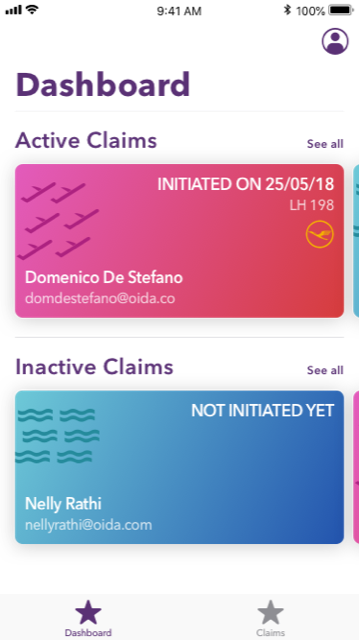
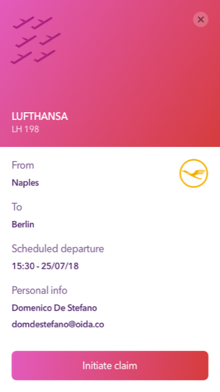

## Introduction

This is a small project of mine built in 2018. It is the backend of a flight insurance prototype, running in Ethereum. It uses Solidity smart contracts and Oracles from oraclize. Every insurance policy is represented as a smart contract, and if a significant delay occurs (using oraclize), the user can easily start the claim process, and the smart contracts pays back the user Eth. The flight delays are fetched from flightstats.com

